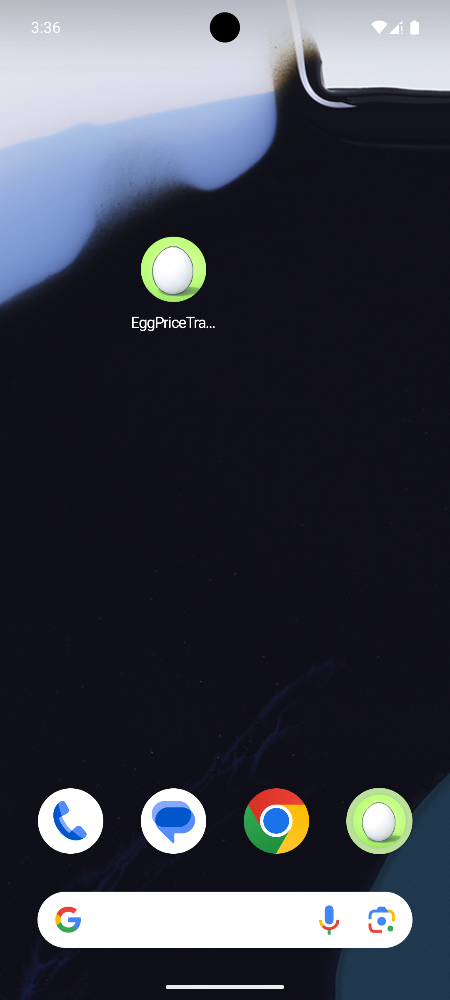
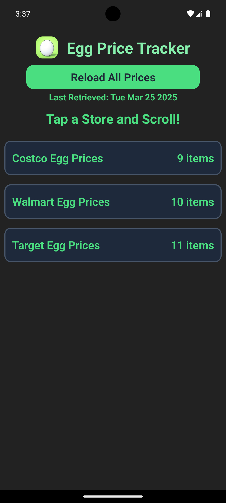
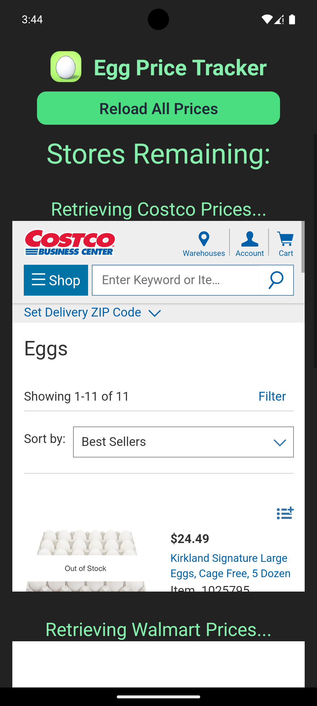
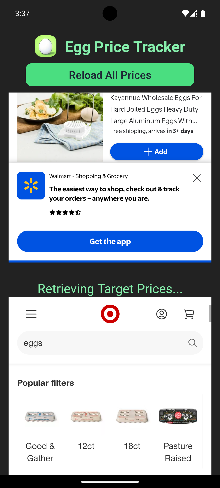
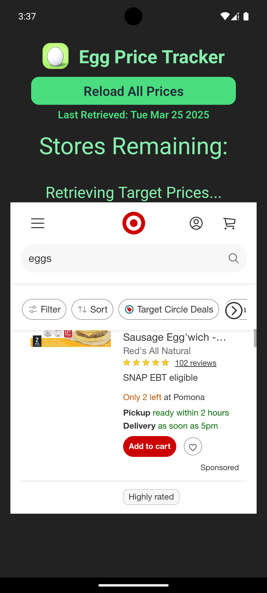
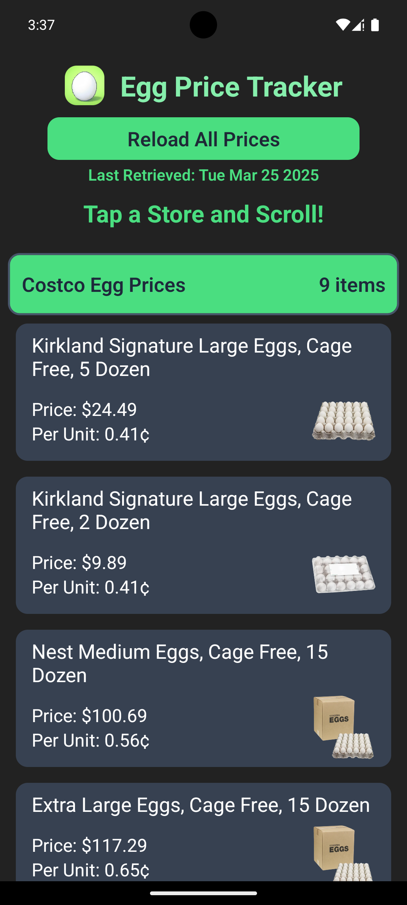
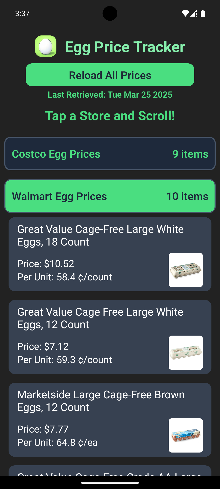
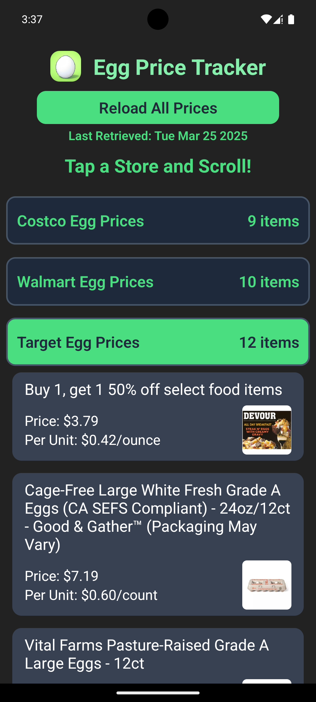

# Egg Price Tracker - Web Scraper App

A **React Native** mobile application that uses **WebView** to scrape egg prices from popular store websites and stores previous scraped data for quick access.  

## ✨ Features  

- 🌍 **Web Scraping via WebView** – Extract and display egg prices from store websites directly in the app.  
- 🎨 **Styled with NativeWind** – Utilizes NativeWind for styling.  
- 💾 **Persistent Storage with Async Storage** – Store previously scraped data for quick retrieval.  

## 🎥 Demo Video  

[Demo Video link](https://youtube.com/watch/v5SerNyKNf0)

## 📸 Screenshots  

### 🏠 Home Screen  
  
  

### 🌍 WebView Scraping in Action  

### WebScraped Results

## 🛠️ Technologies Used
- **React Native** – Cross-platform mobile framework.
- **TypeScript** – Strongly typed JavaScript.
- **NativeWind** – Tailwind CSS for React Native.
- **React Native WebView** – Embedded web content.
- **Async Storage**  – Persistent local storage.

## 🐞 Known Issues  
- On first launch when installed, Costco webscrapes without a zipcode, causing overflow on list and no prices. Fixes itself after reloading prices
- Zipcode on stores are not always accurate. A zipcode is automatically added to the store's webview when loading website. Can be manually changed.

## 🔮 Future Improvements  
- Implement zipcode input
- Enhance UI responsiveness across all screen sizes.  
- Include other popular stores
- Store up to 7 days of data and allow user to view any previous day